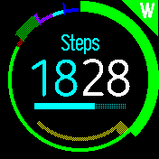
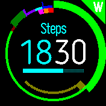

# Time Harvester 

>Digital clock with large segmented ring gauges to show accumulated fruitful time 
>spent by category, and “fallow” rest time available, as well as over-rested time

## Overview
The concept of this clock is to give an always-visible summary of the fruitfulness 
of your day so far in a few broad categories, as well as time spent in balanced 
or excessive rest. At any moment, it’s accumulating time spent in one category or 
another, whether one of the configured fruitful categories, [centering/self-limiting 
rest](https://intend.do/articles/centering-distractions-are-good-for-focus), or 
divergent distraction. Fruitful time also accumulates a buffer 
of some fraction (1/3 by default) for later resting, which can be spent as you 
see fit (like Pomodoro, but more flexible). Running out of this “fallow” buffer 
while doing something centering just leaves it empty (so you can eat a meal or 
go to sleep), but running out while doing something divergent will count up the 
deficit and show a counter-clockwise gauge segment for each category.

The outer ring shows fruitful categories, with a thinner ring of colored segments 
matching your targets just inside. (There are seven fruitful categories below, 
one of which has surpassed its target.)

If you surpass a target for a particular fruitful category, or you run over the 
fallow buffer in a divergent mode, those will appear in a ring inside the outer 
one, starting from the top center and going clockwise for fruitful, and 
counter-clockwise for divergent. These have no fixed duration and will be run 
together. (Below, you can see a few minutes in each of three divergent categories 
I set up, as well as some time in a couple of fruitful categories.)

## Configuration
You can configure categories from the App Loader’s web interface using the floppy 
disk icon near the favorite/heart, or from the watch’s normal settings, although 
the latter can’t currently set category names, so it will just put in placeholders. 
Other settings are all handled from the watch currently, such as hour color, the 
color for the clock-info gauge, and the ratio of fruitful time to fallow buffer.

If you want to focus more on your week as a whole, you can enable target adaptation 
in Settings for individual fruitful categories. This will sum up your total 
progress so far in a week and increase or decrease your relevant targets so you 
can smooth out daily variations and achieve the overall target for the week if 
you hit the target on the last day.

You can also specify customized targets for specific days of the week, such as 0 
for Work on weekends, or a higher target for Reflection on a given day to enable 
deeper thought.

## Usage Details
Switch modes by using the three corner buttons. If you realize you should have 
switched sooner, tap the correct button again and scroll through the menu if 
needed to find the last option, `(Fix start...)`. This will let you select the 
number of minutes to retroactively move from the previous mode to the current,
if there’s a way to make that work. The most recently-selected category in either 
fruitful or divergent will be preselected so you can switch back and forth 
between fallow and fruitful time more quickly.

The clock will buzz with increasing urgency as you run down the fallow buffer in 
a divergent mode, and also every few minutes after that. It will also buzz in a 
hopefully more pleasant way when you’ve hit the target for a given category of 
fruitfulness.

If you switch back to a fruitful mode before the fallow buffer runs out, it will 
be counted in the daily log under “Early Switches”.

There is one slot in the upper middle for a clock-info gauge, which you can choose 
by tapping on it to highlight and using swipes left and right for lists, up and 
down for items (standard behavior). It will not include any non-gauge items.

All times reset at the end of the day, which is currently assumed to be 3 AM 
local. Total times for each category will be logged into CSVs by month (with new 
files generated when you change categories).

From the App Loader’s web interface (using the floppy disk icon near the 
favorite/heart), you can look at how your cumulative time per category compares 
to your targets through the week. If you’re well behind your target, the meter 
should show up as red; if you’re only a bit behind, it should be yellow; if 
you’re on track or a little ahead, it will be green; but if you’ve gone more 
than 20% over your target it should be yellow again. Similarly, if you’ve spent 
less than a small fraction of your overall fallow buffer in excessive divergent 
time, it will show up as green; a larger fraction (currently between 5% and 25%), 
yellow; otherwise, red.

## Credits
Written by: [Nathan Tuggy](https://github.com/tuggyne). For support and discussion, 
please post in [this fork’s issues](https://github.com/TuggyNE/BangleApps/issues).

* Based on the [Daisy Clock](https://banglejs.com/apps/?id=daisy) and thus also [The Ring](https://banglejs.com/apps/?id=thering) proof of concept and the [Pastel clock](https://banglejs.com/apps/?q=pastel)
* Fallow time calculation based on [Third Time](https://www.lesswrong.com/posts/RWu8eZqbwgB9zaerh/third-time-a-better-way-to-work)
* Divergent/centering distinction from [Malcolm Ocean](https://intend.do/articles/centering-distractions-are-good-for-focus)
* Uses the [BloggerSansLight](https://www.1001fonts.com/rounded-fonts.html?page=3) font, which is free for commercial use

## Future Development
* Support fast loading
* Allow configuring buzz patterns
* Show tick marks between the rings to scale hours
* Configure coloring for fallow buffer
* Show some weekly stats from the watch directly
